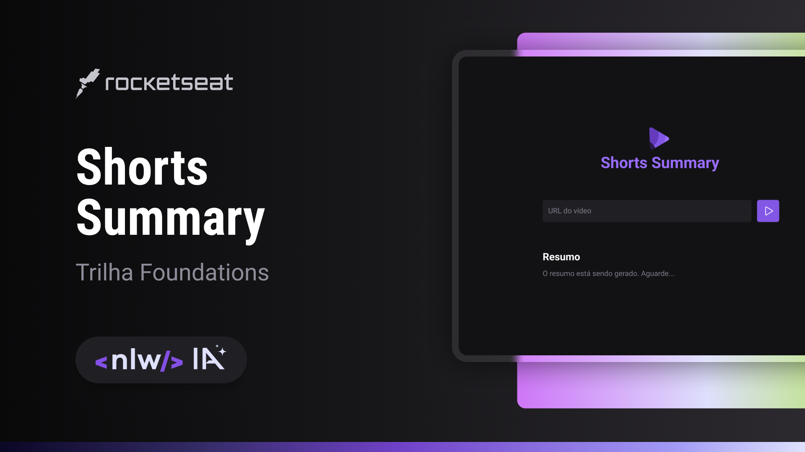
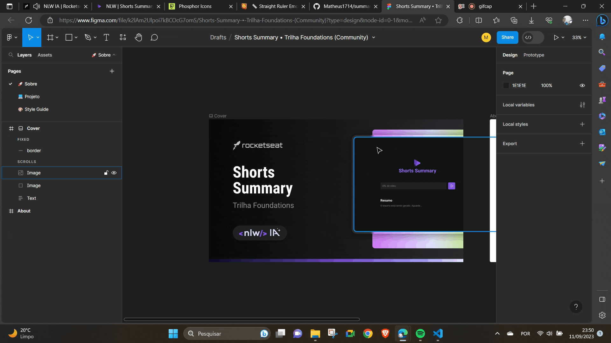

# NLW | Shorts Summary 🚀




<a id="readme-top"></a>

## Table of Content 📜

<!--ts-->

- [About](#about-ℹ️)
- [About NLW](#about-nlw-🚀)
- [Design](#design-📏)
- [DEMO](#demo-🚀)
- [Technologies Used](#technologies-used-⚙️)
- [Features](#features-✅)
- [Package Dependencies](#package-dependencies-⬇️)
- [Running the Project](#running-the-project-🏃)
- [Acknowledge](#acknowledge-☺️)
- [License](#license-📖)
<!--te-->

## About ℹ️

Welcome to the Shots Summary Web project, where you can effortlessly get a summary for youtube shorts generated by AI.

<p align="right"><a href="#readme-top">🔝 Return</a></p>

## About NLW 🚀

NLW (Next Level Week) is an event organized by Rocketseat, dedicated to exploring cutting-edge technologies and empowering programmers to build high-quality projects quickly.

This project was created during NLW to embrace and master the latest technologies, resulting in an application powered by multiple advanced technologies.

<p align="right"><a href="#readme-top">🔝 Return</a></p>

## Design 📏

The design can be found in the [Figma Design](<https://www.figma.com/file/k2lAm2Ulpoi7kBCOcG7omS/Shorts-Summary-%E2%80%A2-Trilha-Foundations-(Community)?type=design&node-id=0%3A1&mode=design&t=PlMmeQp6vUUVTmkE-1>).



## DEMO 🚀

To access the application click on link [Application DEMO]()

<p align="right"><a href="#readme-top">🔝 Return</a></p>

## Technologies Used ⚙️

The technologies utilized in this project include:

- [ReactJS + Vite](https://vitejs.dev/)
- [Typescript](https://www.typescriptlang.org/)

<p align="right"><a href="#readme-top">🔝 Return</a></p>

## Features ✅

- [x] Create Screens
- [ ] Integrate a Back-end
- [ ] Integrate OpenAI

<p align="right"><a href="#readme-top">🔝 Return</a></p>

## Package Dependencies ⬇️

Here is a list of the project's package dependencies:

```json
"dependencies": {
   "@phosphor-icons/react": "^2.0.10",
   "react": "^18.2.0",
   "react-dom": "^18.2.0"
},
"devDependencies": {
   "@types/react": "^18.2.15",
   "@types/react-dom": "^18.2.7",
   "@typescript-eslint/eslint-plugin": "^6.0.0",
   "@typescript-eslint/parser": "^6.0.0",
   "@vitejs/plugin-react": "^4.0.3",
   "eslint": "^8.45.0",
   "eslint-plugin-react-hooks": "^4.6.0",
   "eslint-plugin-react-refresh": "^0.4.3",
   "typescript": "^5.0.2",
   "vite": "^4.4.5"
}
```

<p align="right"><a href="#readme-top">🔝 Return</a></p>

## Running the Project 🏃

To get started with the project, follow these steps:

1. Install the project dependencies:

```
npm i
```

2. Execute the following command in your terminal to run the project:

```
npm run dev
```

<p align="right"><a href="#readme-top">🔝 Return</a></p>

## Acknowledge ☺️

A special thanks to Rocketseat and their dedicated instructors who provide incredible content to the React community, making projects like this possible. Your guidance and support are greatly appreciated.

<p align="right"><a href="#readme-top">🔝 Return</a></p>

## License 📖

This project is open-source and is distributed under the MIT License. Feel free to explore, modify, and utilize the codebase according to the terms outlined in the license.
